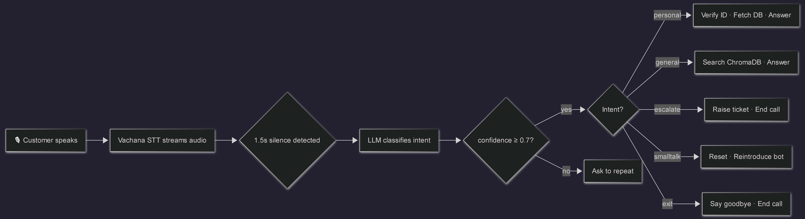

<div align="center">

# Banking Voice Agent with Intelligent Routing

**A production-grade voice agent that understands how Indians actually speak.**

English · Hindi · Telugu · Hinglish · Tenglish — under 4 seconds per turn.

[](https://python.org)
[](https://groq.com)
[](https://vachana.ai)
[](https://chromadb.com)
[](LICENSE)

[Full visual documentation →](https://niharnandala.github.io/Banking_Voice_Agent_With_intelligent_Routing/)

</div>

---

## What it does

Customer calls. Speaks naturally in whatever language they are comfortable in. The agent understands what they want, verifies who they are, fetches their real account data, and responds — all without menus, buttons, or hold music.

```
"mera balance kya hai"          →  personal   →  DB lookup      →  Hindi response
"how to open an account"        →  general    →  RAG search     →  policy answer  
"address change karna hai"      →  escalate   →  ticket raised  →  staff handoff
"i want to know EMI policies"   →  general    →  knowledge base →  spoken answer
```

---

## Real session output — no edits

```
bot:   Hello, welcome to XYZ Bank. Ask me anything about your account.

user:  mera balance kya hai
       intent: personal, confidence: 0.95

bot:   Please tell me your customer id.

user:  my customer id is cu 007
       customer_id: CU007 · verified in DB · data fetched

bot:   Dhanyawad sir. Aapka balance 1.5 lakh rupees hai.

user:  could you get me some bank emi policies
       intent: general, confidence: 0.80
       kept 5 chunks after drop detection

bot:   EMI har mahine 5 ko automatically deducted hota hai sir.
       Bounce charge 500 rupees per instance hai.

user:  i want to change my bank account
       intent: escalate, confidence: 0.85
       ESCALATION TICKET RAISED · ticket: 43A5E499

bot:   I have raised a ticket for you sir. Staff will contact you shortly.
```

**Real latency from the same session**

| Stage | Time |
|---|---|
| Intent classification | 0.0s |
| Customer ID extraction | 0.0s |
| Knowledge base search | 0.0s |
| Answer generation | 0.0s |
| Bot speaking | 2.8s to 3.4s |
| Full turn end to end | under 4 seconds |

---

## How it works




---

## Intent routing in detail


---

## Why these tools

| Decision | Chosen | Rejected | Reason |
|---|---|---|---|
| Speech to Text | Vachana by Gnani.ai | Whisper, Azure Speech | Trained on 1M+ hours of Indian voice data across BFSI. Generic models fail on code-switching and broken speech. |
| LLM Inference | Groq + LLaMA 3.1 8B | OpenAI GPT-4, Gemini | Sub-100ms inference. 3 to 5x faster than OpenAI. Zero cost. |
| Vector Search | ChromaDB local | Pinecone, Weaviate | Runs on disk. Loads once. No API cost. No network dependency. |
| ID Extraction | LLM prompt | Regex | "see you zero zero one", "c u 001" — callers say IDs in ways regex cannot handle. LLM reads intent not characters. |
| Retrieval cutoff | Dynamic drop detection | Fixed threshold | Fixed 0.7 threshold is unreliable across models. Drop detection adapts to the shape of scores instead. |

### Dynamic drop detection explained

```
scores:   0.91   0.89   0.85   0.61   0.58
gaps:            0.02   0.04   0.24   0.03
                               ↑
                        gap of 0.24 is bigger than threshold 0.15
                        cut here — keep first 3, discard the rest
```

A fixed threshold of 0.7 would have kept everything above it regardless of whether it was actually relevant. Drop detection keeps only what is clearly better than everything that follows it.

---

## Production bugs fixed

These do not appear in tutorials. They only show up when you actually run this.

<details>
<summary><strong>Thread-unsafe audio queue</strong></summary>

sounddevice fires `mic_callback` on its own OS thread. `asyncio.Queue` is not thread safe. Calling `put_nowait` directly from that thread while the event loop is doing a `get` causes silent data corruption — audio drops, occasional crashes, never reproducible consistently.

```python
# wrong — audio thread touches queue directly
audio_queue.put_nowait(indata[:, 0].copy())

# correct — audio thread asks event loop to do it
_main_loop.call_soon_threadsafe(audio_queue.put_nowait, indata[:, 0].copy())
```
</details>

<details>
<summary><strong>TTS completion sync — bot was hearing itself</strong></summary>

Old code fired `Speak()` and returned instantly. Mic reopened while the bot was still talking. Bot transcribed its own voice as a new user question.

Fix: unique marker written to PowerShell stdout after each `Speak()`. Code blocks reading stdout until marker appears. Mic only opens after speech is confirmed done.
</details>

<details>
<summary><strong>Infinite recursion between personal handler and intent classifier</strong></summary>

Failed customer ID → back to intent classifier → back to ID handler → repeat forever. No exit condition.

Fix: `retry_count` passed through every call and incremented on each bounce. After 3 failures the system escalates to a human instead of looping.
</details>

<details>
<summary><strong>listen_once hang in async for loop</strong></summary>

In `listen_once` mode, `receive()` sat blocked inside `async for event in stream` with nothing to wake it once `done` was set. The entire listening session would hang indefinitely.

Fix: `send_audio`, `receive`, and `done.wait` run as separate tasks raced with `asyncio.wait(FIRST_COMPLETED)`. Whatever is still running gets explicitly cancelled.
</details>

<details>
<summary><strong>Circular imports</strong></summary>

`llm_intent.py` imports handlers. Handlers need `run_intent` from `llm_intent.py`. Top-level import causes Python to get stuck mid-load — A imports B, B imports A, A is still loading.

Fix: import `run_intent` inside the function body only, never at module level in handler files.
</details>

<details>
<summary><strong>LLM JSON parsing crashes</strong></summary>

LLMs told to return only JSON sometimes wrap it in markdown fences or add a sentence before it. Raw `json.loads` crashes on this and kills the call.

Fix: shared `safe_parse_json` in `utils.py` strips backtick fences, strips json label, tries to parse, falls back to a safe default on failure. Used everywhere.
</details>

---

## File structure

```
llm_intent.py              entry point · main loop · intent router
vachana_stt/
    vachana.py             mic input · STT streaming · TTS output · silence detection · 20s timeout
handlers/
    personal.py            customer id extraction · DB lookup · account answers
    general.py             knowledge base search · policy answers
    escalate.py            ticket generation · staff handoff
    smalltalk.py           conversation reset · bot reintroduction
scripts/
    queries.py             DB functions · customer data fetch · id validation
knowledge_base.py          ChromaDB search · embedding · dynamic drop detection
utils/
    utils.py               safe JSON parser · markdown cleaner · shared helpers
connections/
    connections.py         API keys · DB connection · audio queue
```

---

## This pipeline works for any industry

The core — multilingual STT, intent routing, RAG retrieval, spoken response — is domain agnostic. Swap the knowledge base and DB schema. Everything else stays.

| Industry | What changes | Business value |
|---|---|---|
| Healthcare | Patient DB + symptom knowledge base | Appointment booking and prescription reminders in local language 24x7 |
| Logistics | Shipment DB + delivery policy docs | Zero hold time for tracking and rescheduling calls |
| E-commerce | Order DB + returns policy | Handles the 80% of routine calls so human agents handle the 20% that matter |
| Government | Scheme DB + eligibility docs | Reaches Tier 2 and 3 cities in Hindi and Telugu — only way to reach those users |
| Telecom | Subscriber DB + plan docs | Plan queries, balance checks, complaint escalation without a call centre |

---

## Roadmap

**Done**
- Voice pipeline end to end
- Intent classification in English, Hindi, Telugu, Hinglish, Tenglish
- Personal queries with customer ID extraction and DB lookup
- RAG pipeline with dynamic drop detection
- Escalation with ticket generation and conversation summary
- 20 second silence timeout
- Error handling across all layers
- Customer ID validation against DB

**In progress**
- Vachana TTS to replace Windows system voice — email sent to Gnani, waiting for API access
- ChromaDB warm start from session begin to eliminate cold start delay
- Response naturalness improvements

**Planned**
- FastAPI layer for deployment as a service
- Docker containerisation
- Structured call logging
- Latency and intent accuracy monitoring
- OTP verification layer

---

## Honest tradeoffs

**No OTP or email verification** — customer ID validated against DB is the current identity gate. OTP is on the roadmap but out of scope for this version.

**No paid LLMs** — LLaMA 3.1 8B on Groq handles everything. Fast enough for real-time voice. Zero cost to run.

**Windows only TTS** — PowerShell System.Speech for now. Vachana TTS will make this platform agnostic once API access lands.

**ChromaDB cold start** — first general query of a session adds a few seconds while the embedding model loads. Fixing this by warming from startup regardless of query type.

---

## Quick start

```bash
pip install sounddevice numpy groq chromadb sentence-transformers mysql-connector-python gnani-stt
```

Set up `connections/connections.py`

```python
import asyncio, groq, mysql.connector

VACHANA_API_KEY = "your_vachana_key"
audio_queue     = asyncio.Queue()
groq_client     = groq.Groq(api_key="your_groq_key")
db_conn         = mysql.connector.connect(
    host="localhost", user="your_user",
    password="your_password", database="your_db"
)
```

Build the knowledge base — run once, saves to disk

```bash
python knowledge_base.py
```

Start the agent

```bash
python llm_intent.py
```

---

<div align="center">

Built by **Nihar Nandala**

[GitHub](https://github.com/niharnandala) · [Full visual docs](https://niharnandala.github.io/Banking_Voice_Agent_With_intelligent_Routing/)

</div>