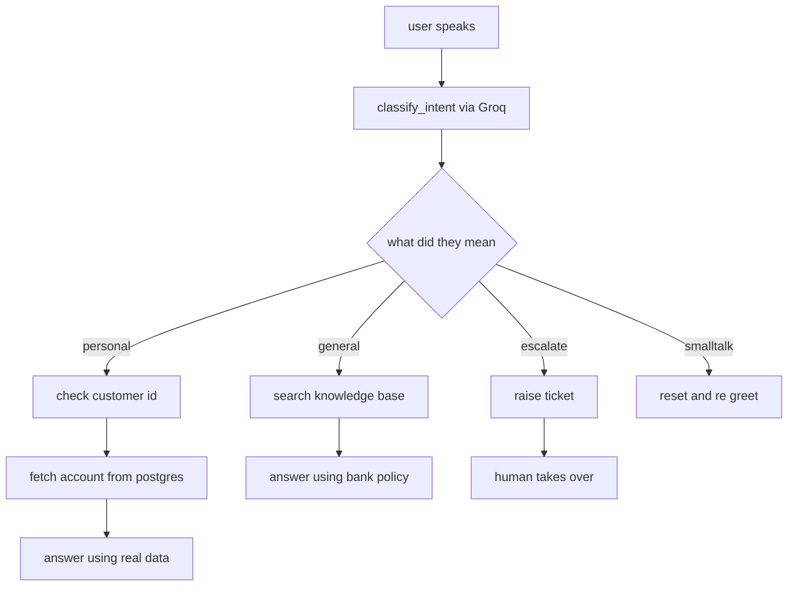
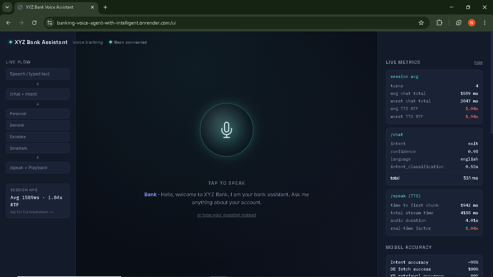
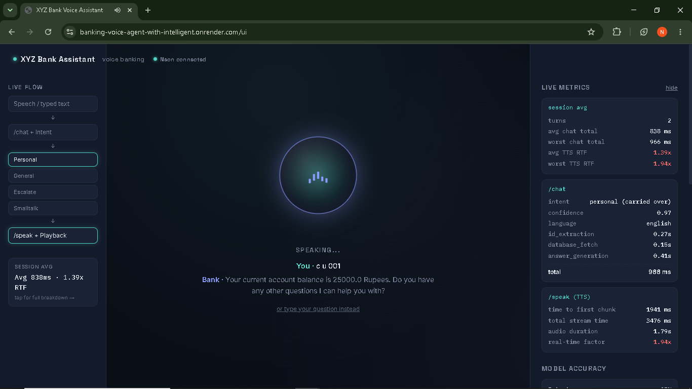
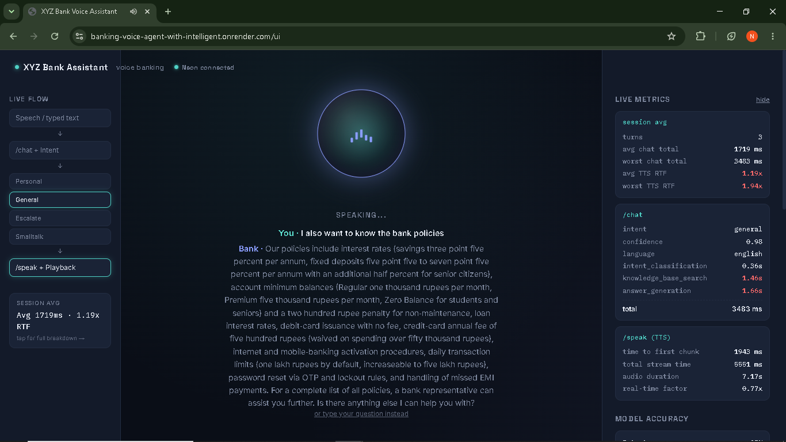

<div align="center">

# Banking Voice Agent

A voice bot that lets a bank customer talk normally, in whatever language they actually speak, and get a real answer back about their account.

Built by Nihar Nandala

[](https://python.org)
[](https://groq.com)
[](https://vachana.ai)
[-336791?style=flat-square&logo=postgresql&logoColor=white)](https://neon.tech)
[](LICENSE)

[](https://banking-voice-agent-with-intelligent.onrender.com/ui)

**[full build notes, bugs and all →](ENGINEERING.md)**


https://github.com/user-attachments/assets/235f395f-43f0-465a-a93a-697416c0d638

**[▶ watch the demo video](https://drive.google.com/file/d/1iRFWrVh8Go262TinqsGVLbgLa5nKBTIG/view?usp=sharing)**

</div>

---

### contents

- [what it does](#what-it-does)
- [how it routes a request](#how-it-routes-a-request)
- [screenshots](#screenshots)
- [what i actually measured, not just claimed](#what-i-actually-measured-not-just-claimed)
- [what i picked and why](#what-i-picked-and-why)
- [the honest parts — bugs and what's not handled yet](#the-honest-parts)
- [run it yourself](#run-it-yourself)
- [file layout](#file-layout)

---

## what it does

```
"mera balance kya hai"          →  personal    →  db lookup       →  hindi reply
"how to open an account"        →  general     →  rag search      →  policy answer
"address change karna hai"      →  escalate    →  ticket raised   →  human takes over
```

people don't talk to a bank in clean textbook english, they mix hindi and english mid sentence, type hindi using english letters, switch languages between turns. this is built around that instead of pretending it doesn't happen.

try it yourself, seeded fake customers, nothing real: `CU001` `CU002` `CU003` `CU004` `CU005` `CU007`

first request after it's been idle can take 30 to 60 seconds, that's render waking the container back up, not the app being broken.

---

## how it routes a request



```mermaid
flowchart TD
    A[user speaks] --> B[classify_intent via Groq]
    B --> C{what did they mean}
    C -->|personal| D[check customer id] --> E[fetch account from postgres] --> F[answer using real data]
    C -->|general| G[search knowledge base] --> H[answer using bank policy]
    C -->|escalate| I[raise ticket] --> J[human takes over]
    C -->|smalltalk| K[reset and re greet]
```

---

## screenshots

<table>
<tr>
<td></td>
<td></td>
</tr>
<tr>
<td></td>
<td></td>
</tr>
</table>


---

## what i actually measured, not just claimed

ran a real eval harness (`eval_full.py`) through the actual pipeline, real groq calls, real postgres, real chromadb, nothing mocked, on a 95 case labeled test set.

| what | result |
|---|---|
| intent classification accuracy | **95.8%** (91/95) |
| language detection accuracy | **93.7%** (89/95) |
| personal data fetch success | **24/24**, 100% |
| knowledge base retrieval accuracy | **27/30**, 90% |
| escalation routing accuracy | **18/20**, 90% |
| classify latency | p50 **2.97s**, p95 **10.2s** |

that 90% escalation number only measures whether the classifier routed an escalate worthy message correctly, not the real world escalation rate, which also includes stuff a single message can't show, like someone failing id verification three times in a row. kept these separate on purpose instead of blending into one number that oversells itself.

---

## what i picked and why

| piece | using | skipped | why |
|---|---|---|---|
| speech to text | Vachana by Gnani.ai | Whisper, Azure | trained on indian voice data, handles code switching generic models fumble |
| LLM | Groq, gpt oss 120b | llama 3.1 8b, started here | small model kept mistaking indian english for hindi in roman letters, and llama 3.1 8b is getting retired by groq |
| vector search | ChromaDB, local | Pinecone, Weaviate | no api bill, no network dependency, loads once |
| id extraction | LLM prompt | regex | people say ids like "see you zero zero one" out loud, regex can't parse that |
| retrieval cutoff | dynamic drop detection | fixed 0.7 threshold | a flat number works on one dataset and lets garbage through on another |
| database | Postgres on Neon, pooled | one shared connection, started here | one connection meant every balance check waited in line behind the last one |

---

## the honest parts

### bugs that only showed up once it was live

<details>
<summary>one shared db connection was quietly making everyone wait</summary>

every personal question hit the same single `psycopg2` connection, and a connection can only run one query at a time, so under real traffic, balance checks queued up one by one with nothing looking broken from the outside.

fixed with a pool. borrow a connection, use it, hand it back.

```python
conn = db_conn.getconn()
try:
    cursor = conn.cursor()
    cursor.execute(query)
finally:
    db_conn.putconn(conn)
```
</details>

<details>
<summary>circular imports between the router and the handlers</summary>

the intent router needs the handlers, the handlers need a function back from the router, import both at the top of each file and python gets stuck loading them.

fixed by importing that one function inside the function body where it's actually used, never at the top.
</details>

### what's not handled yet

- **sessions live in memory, per instance.** fine running as one process, which is what this is deployed as. more than one instance and a caller could land somewhere that never saw their session
- **the db pool is per instance too.** three instances means three separate pools hitting neon, not one shared pool of five
- **no otp or email check**, customer id against the database is the only identity gate
- **no automated test suite**, `eval_full.py` checks accuracy and latency, it's an eval harness not unit tests
- **a local only playback path exists** for testing on my own machine, never runs on the deployed server

---

## run it yourself

```bash
pip install -r requirements.txt
python scripts/knowledge_base.py      # builds the vector index once
python scripts/setup_database.py      # seeds test customers
uvicorn app:app --reload
```

or with docker:

```bash
docker build -t banking-voice-agent .
docker run -p 8000:8000 --env-file .env banking-voice-agent
```

`connections/connections.py` needs `GROQ_API_KEY`, a pooled Neon `DB_HOST` (the one with `-pooler` in it), and your Vachana keys, all read from `.env`.

---

## file layout

```
app.py                    fastapi entry, sessions, /chat /speak /session /health
llm_intent.py             intent + language classifier
handlers/                 personal, general, escalate, smalltalk
scripts/                  db queries, knowledge base search + drop detection
utils/                    safe json parsing, prompt loading
prompts/                  raw prompt text
connections/              api keys, pooled db connection, groq client
Gnani_Vachana_TTS/        streaming and full file tts for the browser
assets/                   screenshots, demo video, flow diagrams
```

---

<div align="center">

[GitHub](https://github.com/niharnandala)

</div>
