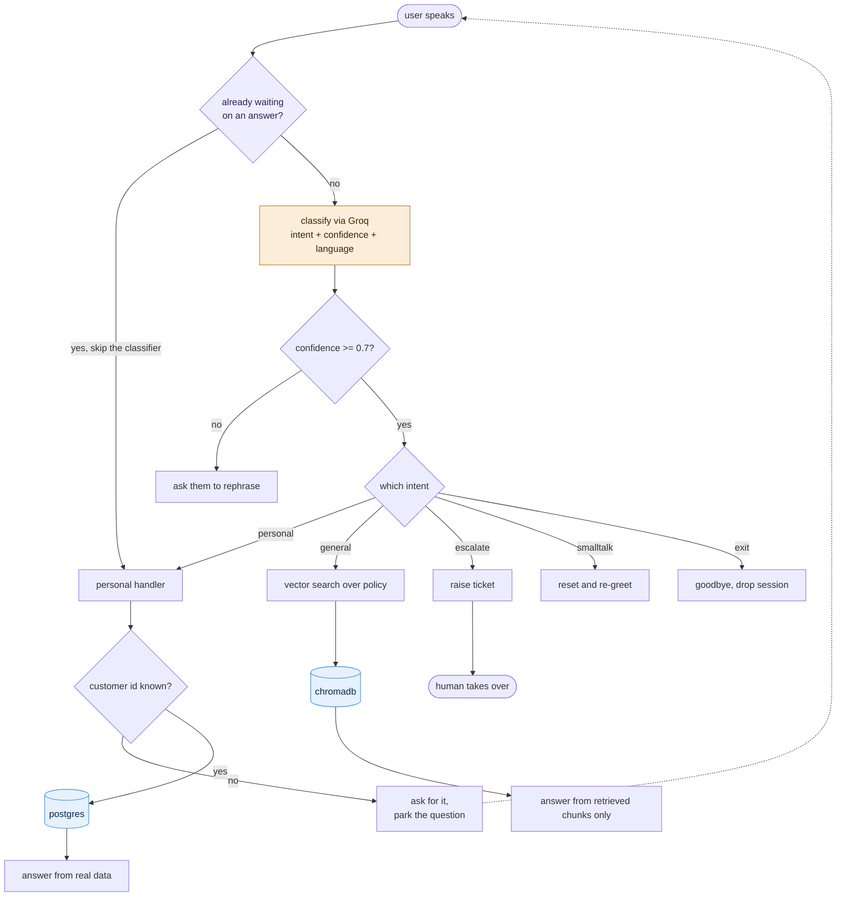
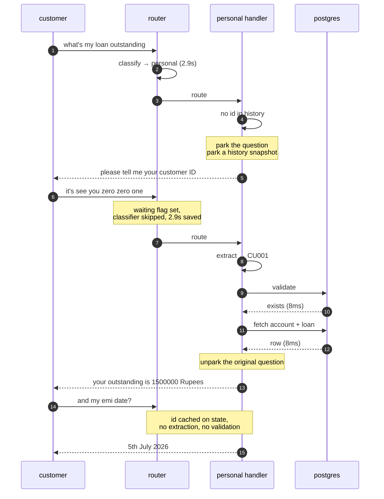

<div align="center">

# Banking Voice Agent

A voice bot that lets a bank customer talk normally, in whatever language they actually speak, and get a real answer back about their account.

Built by Nihar Nandala

[](https://python.org)
[](https://langchain-ai.github.io/langgraph/)
[](https://groq.com)
[](https://vachana.ai)
[-336791?style=flat-square&logo=postgresql&logoColor=white)](https://neon.tech)
[](LICENSE)

[](https://banking-voice-agent-with-intelligent.onrender.com/ui)

**[full build notes, bugs and all →](ENGINEERING.md)**

https://github.com/user-attachments/assets/235f395f-43f0-465a-a93a-697416c0d638

</div>

---

<div align="center">

| intent accuracy | language accuracy | retrieval accuracy | db fetch | median latency |
|:---:|:---:|:---:|:---:|:---:|
| **95.8%** | **93.7%** | **90%** | **100%** | **2.97s** |
| 91/95 | 89/95 | 27/30 | 24/24 | p95 10.2s |

every number here recomputes from `eval_results.csv`, committed in the repo

</div>

---

### contents

- [what it does](#what-it-does)
- [how it routes a request](#how-it-routes-a-request)
- [the part that isn't a single turn](#the-part-that-isnt-a-single-turn)
- [screenshots](#screenshots)
- [what i measured](#what-i-measured)
- [where the latency actually goes](#where-the-latency-actually-goes)
- [where it fails, and what the failures mean](#where-it-fails-and-what-the-failures-mean)
- [what i picked and why](#what-i-picked-and-why)
- [the honest parts](#the-honest-parts)
- [run it yourself](#run-it-yourself)
- [file layout](#file-layout)

---

## what it does

```
"mera balance kya hai"          →  personal    →  db lookup       →  hindi reply
"how to open an account"        →  general     →  rag search      →  policy answer
"address change karna hai"      →  escalate    →  ticket raised   →  human takes over
```

people don't talk to a bank in clean textbook english, they mix hindi and english mid sentence, type hindi using english letters, switch languages between turns. this is built around that instead of pretending it doesn't happen.

try it yourself, seeded fake customers, nothing real: `CU001` `CU002` `CU003` `CU004` `CU005` `CU007`

`CU004` is the interesting one, balance below the minimum **and** an overdue emi, so you can watch it answer two bad news questions in a row without contradicting itself.

first request after it's been idle can take 30 to 60 seconds, that's render waking the container back up, not the app being broken.

---

## how it routes a request

every message gets sorted into one of five buckets before anything else happens. a policy question and an account question are not the same problem and don't share a code path.


```mermaid
flowchart TD
    A([user speaks]) --> B{already waiting<br/>on an answer?}
    B -->|yes, skip the classifier| P
    B -->|no| C[classify via Groq<br/>intent + confidence + language]
    C --> D{confidence >= 0.7?}
    D -->|no| U[ask them to rephrase]
    D -->|yes| E{which intent}

    E -->|personal| P[personal handler]
    E -->|general| G[vector search over policy]
    E -->|escalate| I[raise ticket]
    E -->|smalltalk| K[reset and re-greet]
    E -->|exit| X[goodbye, drop session]

    P --> P1{customer id known?}
    P1 -->|no| P2[ask for it,<br/>park the question]
    P2 -.-> A
    P1 -->|yes| P3[(postgres)]
    P3 --> ANS[answer from real data]
    G --> G2[(chromadb)]
    G2 --> ANS2[answer from retrieved chunks only]
    I --> J([human takes over])

    style C fill:#FAEEDA,stroke:#BA7517,color:#412402
    style B fill:#EEEDFE,stroke:#7F77DD,color:#26215C
    style P3 fill:#E6F1FB,stroke:#378ADD,color:#042C53
    style G2 fill:#E6F1FB,stroke:#378ADD,color:#042C53
```

this runs as a **LangGraph state machine**, not a chain of if statements. nodes are handlers, edges are functions that read conversation state and return the next node name. two things fall out of that:

- **the waiting shortcut** at the top. if a handler already asked the customer something, the classifier is skipped entirely. that's one full llm round trip saved, roughly **3 seconds** off a turn where the intent was never in doubt
- **the retry diversion.** if someone has failed id verification three times, the personal branch refuses and reroutes to escalate before the handler is even entered. the guard lives in the edge, not buried inside the handler

---

## the part that isn't a single turn

most voice bot demos answer one question and stop. the harder problem is needing something from the customer before you can answer them.


```mermaid
sequenceDiagram
    autonumber
    participant C as customer
    participant R as router
    participant H as personal handler
    participant DB as postgres

    C->>R: what's my loan outstanding
    R->>R: classify → personal (2.9s)
    R->>H: route
    H->>H: no id in history
    Note over H: park the question<br/>park a history snapshot
    H-->>C: please tell me your customer ID

    C->>R: it's see you zero zero one
    Note over R: waiting flag set,<br/>classifier skipped, 2.9s saved
    R->>H: route
    H->>H: extract → CU001
    H->>DB: validate
    DB-->>H: exists (8ms)
    H->>DB: fetch account + loan
    DB-->>H: row (8ms)
    Note over H: unpark the original question
    H-->>C: your outstanding is 1500000 Rupees

    C->>R: and my emi date?
    Note over R,H: id cached on state,<br/>no extraction, no validation
    H-->>C: 5th July 2026
```

cost per turn as state accumulates:

| turn | llm calls | db hits |
|---|---|---|
| 1, asking for the id | 2 | 0 |
| 2, verifying and answering | 2 | 2 |
| 3+, everything after | **1** | **1** |

### two bugs that only exist because of that detour

**the question gets lost.** by the time the id arrives, the last thing the customer said is an id, not a question. the original code scanned backwards through history for "a message that doesn't look like an id", which never matched, because nobody says a clean `CU001` out loud, they say *"it's c u zero zero one"*. now the question is parked explicitly on state when the detour starts.

**the context poisons the answer.** grab recent history after verification and the last two turns are always *"please tell me your customer id"* and the customer reading it out. feed that in as context and the model decides the conversation is about collecting an id, so it asks again instead of answering. fixed by snapshotting history **before** the detour begins, so that exchange physically can't be in scope.

same reason language is detected once at classification and cached on state rather than per handler. on turn 2 the input text is a spoken customer id, and you cannot tell someone speaks telugu from hearing *"c u zero zero one"*.

---

## screenshots

<table>
<tr>
<td></td>
<td></td>
</tr>
<tr>
<td></td>
<td></td>
</tr>
</table>

---

## what i measured

ran a real eval harness (`eval_full.py`) through the actual pipeline, real groq calls, real postgres, real chromadb, nothing mocked, 95 labeled cases. raw per case output is committed as `eval_results.csv`, so nothing below has to be taken on trust.

**per intent**, so one weak class can't hide behind a good average:

```
smalltalk  ██████████████████████████████████████████████████  13/13   100%
exit       ██████████████████████████████████████████████████    8/8    100%
general    ████████████████████████████████████████████████▎   29/30    97%
personal   ███████████████████████████████████████████████▉    23/24    96%
escalate   █████████████████████████████████████████████       18/20    90%
                                                              ─────────────
                                                               91/95  95.8%
```

that 90% escalation number only measures whether the classifier routed an escalate worthy message correctly. it is **not** the real world escalation rate, which also includes things a single message can't show, like failing id verification three times, or a knowledge base search coming back empty. those are separate paths into the same handler. kept apart on purpose instead of blended into one number that oversells itself.

---

## where the latency actually goes

measured per stage across the same 95 cases:

```
intent classification (groq)  ████████████████████████████████████████  2968 ms
knowledge base search         ▌                                           30 ms
account fetch (postgres)      ▏                                            8 ms
```

the database answers in **8 milliseconds** and the vector search in **30**. the model call is **2,968**. retrieval and storage are effectively free, and any optimisation that isn't about the llm round trip is optimising the wrong 1%.

that's also what justifies the waiting shortcut. skipping one classification isn't a micro-optimisation, it's removing the single dominant cost of the turn.

| stage | p50 | p95 | max |
|---|---|---|---|
| intent classification | 2.968s | 10.197s | 11.182s |
| knowledge base search | 0.030s | 0.043s | 0.136s |
| account fetch | 0.008s | 0.010s | 0.040s |

**about that p95.** the eval fires 95 requests back to back with no spacing, a burst pattern that trips groq's rate limiting, and calls that normally take 1 to 2 seconds start landing at 8 to 11. the p50 reflects normal behaviour, the p95 reflects the harness hammering the api. reported both rather than quietly publishing the p50 alone.

---

## where it fails, and what the failures mean

10 failures across the run. all of them are more interesting than the 95.8%.

### the confidence threshold never actually fires

there's a `CONFIDENCE_THRESHOLD = 0.7` gate meant to catch uncertain classifications. across all 95 cases:

```
mean confidence, correct     0.960  ████████████████████████████████████████████████
mean confidence, INCORRECT   0.955  ███████████████████████████████████████████████▊
the threshold                0.700  ███████████████████████████████████
                                    └─ nothing ever landed here. lowest score was 0.90
```

**0.005 of separation between right and wrong.** the four wrong answers came in at 0.95, 0.95, 0.95 and 0.97. the model is confidently wrong, not uncertain, so a self reported confidence score is not a usable safety net here. it stays in as a guard against a genuinely broken response, but it isn't catching the failure mode that actually exists.

### the 4 intent misses

| utterance | labeled | predicted | conf |
|---|---|---|---|
| "what is the minimum balance in my account" | personal | general | 0.97 |
| "how do I file a complaint with the bank" | general | escalate | 0.95 |
| "why is my account frozen" | escalate | general | 0.95 |
| "why was my loan application rejected" | escalate | general | 0.95 |

row 2 is arguably a bad label, not a bad prediction. the routing prompt explicitly lists *"is making a complaint"* under escalate, so the model followed the instruction it was given and my ground truth disagreed with my own prompt.

rows 3 and 4 are the real gap. both are *"explain a decision about my account"*, which doesn't fit cleanly into personal, general or escalate. that's a taxonomy problem, not a model problem, and adding a class won't fix it without a clearer boundary first.

### 93.7% language accuracy is one bucket, not a spread

```
english   ██████████████████████████████████████████████████  70/70   100%
telugu    ██████████████████████████████████████████████████    8/8    100%
hinglish  ██████████████████████████████████████████████████    6/6    100%
hindi     ██████████████████████                                5/11    45%
```

every single failure is hindi, and every one is hindi predicted as hinglish. never the reverse, never any other pair. the six inputs:

```
mera account balance kya hai
mera EMI kab due hai
mera loan status kya hai
mera phone number kya hai registered
savings account ke liye minimum balance kitna hai
mera paisa chori ho gaya, complaint karni hai
```

they all contain english loanwords. *account, balance, EMI, loan, status, complaint.* the prompt defines hinglish as *"the sentence mixes actual hindi words and actual english words together"*, which is exactly what these are.

**by my own definition the model is right and my labels are wrong.** that isn't a free pass, it's a worse problem than a model error, because `state["language"]` drives generation. hindi means reply in devanagari, hinglish means mixed script. the boundary needs a real rule, probably *loanwords with no common hindi equivalent don't count as code switching*, before that 93.7% means anything.

### the 3 retrieval misses

`"is there a penalty for not maintaining minimum balance"` · `"what is the daily UPI transaction limit"` · `"can I open an account online without visiting the branch"`

the metric only checks whether the **top** chunk came from the right section, so a correct answer sitting at rank 2 still counts as a miss. two of the three are likely chunking rather than embedding. the chunker splits on a fixed word window with overlap and has no minimum size floor, so a few sections emit a tiny tail fragment that duplicates content already in the previous chunk and competes for the top slot.

---

## what i picked and why

| piece | using | skipped | why |
|---|---|---|---|
| routing | LangGraph state machine | plain if/else dispatch | conditional edges made the waiting shortcut and the retry-to-escalate diversion explicit instead of nested conditions scattered through the handlers |
| LLM | Groq, gpt-oss-120b | llama 3.1 8b, started here | the 8b model kept reading indian english ("kindly do the needful and check my balance") as hindi in roman letters. adding telugu on top needed more headroom. llama 3.1 8b is also on groq's retirement list |
| speech to text | browser Web Speech API | server side STT | keeps audio off the wire entirely, no upload round trip in the response path, no per minute cost. tradeoff is chromium-family browsers only, so there's a text input fallback |
| text to speech | Vachana by Gnani.ai | generic TTS | trained on indian voice data, handles the code switching generic models fumble |
| vector search | ChromaDB, local | Pinecone, Weaviate | 15 chunks. a network hop to a hosted vector db would cost more than the 30ms the whole search currently takes |
| id extraction | LLM prompt | regex | people say ids out loud as "see you zero zero one", "cu double o one", "cu forty five". the variant space is open ended, regex isn't |
| retrieval cutoff | dynamic drop detection | fixed 0.7 threshold | a flat number works on one dataset and lets garbage through on another. this scans for the largest gap in the sorted scores instead, so it adapts to whatever the model's distribution looks like |
| database | Postgres on Neon, pooled | one shared connection, started here | one connection meant every balance check waited in line behind the last one |
| audio delivery | streamed 150ms PCM buffers | wait for the full file | the customer hears the first word while the rest is still being synthesised |

---

## the honest parts

### bugs that only showed up once it was live

<details>
<summary><b>one shared db connection was quietly making everyone wait</b></summary>

<br>

every personal question hit the same single `psycopg2` connection, and a connection can only run one query at a time, so under real traffic balance checks queued up one by one with nothing looking broken from the outside.

fixed with a pool. borrow, use, hand back.

```python
conn = db_conn.getconn()
try:
    cursor = conn.cursor()
    cursor.execute(query)
finally:
    db_conn.putconn(conn)
```

the `finally` matters more than the pool does. skip it and every failed query leaks a connection until the pool is empty, which is a worse failure than the bottleneck it replaced.

there was a second half to this. neon gives you a direct endpoint and a pooled one (the hostname with `-pooler` in it) and my `.env` pointed at the direct one. switching to pooled fixed neon's ceiling but not mine, because the app still only ever made one connection object. both sides had to change.

</details>

<details>
<summary><b>circular imports between the router and the handlers</b></summary>

<br>

the intent router needs the handlers, the handlers need constants back from the router, import both at the top of each file and python gets stuck loading them.

fixed by importing inside the function body where it's actually used, never at the top. `smalltalk.py` is the exception and can import at module level, because by the time the router lazily imports it, the router has finished loading.

</details>

<details>
<summary><b>the blocking calls were freezing every other caller</b></summary>

<br>

`psycopg2` and the groq sdk are both synchronous. calling them directly inside an async endpoint blocks the entire event loop, so one person's balance check stalls everyone else's request on a single worker deployment.

wrapped in `asyncio.to_thread`. easy to miss because it looks completely fine with one user.

</details>

<details>
<summary><b>the browser refused to play the audio</b></summary>

<br>

asking the tts api for `container=wav` on a streamed response puts a wav header on **every chunk**. concatenate those and you get a file with a dozen headers embedded in the middle of the audio data, which the browser just rejects.

fixed by requesting raw PCM and building one valid header over the whole concatenated stream.

there's a second half on the client. PCM samples are 2 bytes and network chunks don't respect that boundary, so a chunk can end mid sample. the leftover byte gets carried into the next chunk instead of dropped. get that wrong and you get audio that degrades into static the longer it plays.

</details>

<details>
<summary><b>fetch() resolves before the audio exists</b></summary>

<br>

`fetch()` returns as soon as **headers** arrive, and FastAPI's StreamingResponse sends 200 OK immediately, before a single byte of audio has been generated. if synthesis then hangs, `await reader.read()` waits forever and there is no exception for a catch block to see.

fixed with a stall timer that resets on every chunk received, rather than a fixed ceiling on total duration. a long legitimate answer doesn't get killed for taking a while, only actual silence does.

</details>

### what's not handled yet

| | |
|---|---|
| **sessions live in memory, per instance** | fine as one process, which is what this is deployed as. more than one instance and a caller could land somewhere that never saw their session. the fix is redis, deferred until there's actually a second instance |
| **the db pool is per instance too** | three instances means three separate pools hitting neon, not one shared pool of five |
| **no otp or email check** | customer id against the database is the only identity gate. fine for a demo, nowhere near enough for anything real |
| **no automated test suite** | `eval_full.py` measures accuracy and latency, that's an eval harness, not unit tests. no coverage of the branch logic itself |
| **`SELECT *` can collide on column names** | `accounts.status` and `loans.status` are both `status`, and `dict(zip(...))` keeps the last one. found it during review, listed here rather than quietly left in |
| **the chunker has no minimum size floor** | sections between 81 and 100 words emit a tail fragment that duplicates the chunk before it |
| **a local only playback path exists** | for testing on my own machine, never runs on the deployed server |

---

## run it yourself

```bash
pip install -r requirements.txt

python scripts/convert_to_jsonl.py    # policy text  →  chunked jsonl
python scripts/knowledge_base.py      # jsonl        →  vector index
python scripts/setup_database.py      # seeds test customers

uvicorn app:app --reload              # http://127.0.0.1:8000/ui
```

or with docker:

```bash
docker build -t banking-voice-agent .
docker run -p 8000:8000 --env-file .env banking-voice-agent
```

`.env` needs `GROQ_API_KEY`, a pooled Neon `DB_HOST` (the one with `-pooler` in it) plus `DB_NAME` `DB_USER` `DB_PASSWORD` `DB_PORT`, and `VACHANA_TTS`.

the vector index is committed to the repo on purpose. render's disk is wiped on every redeploy, so building it locally and shipping it inside the image avoids both a build step and a paid persistent disk.

---

## file layout

```
app.py                    fastapi entry, sessions, /chat /speak /session /health
llm_intent.py             langgraph routing, intent + language classifier
handlers/                 personal, general, escalate, smalltalk
scripts/                  db queries, kb search + drop detection, setup scripts
utils/                    safe json parsing, speech text cleanup
connections/              api keys, pooled db connection, groq client
Gnani_Vachana_TTS/        streaming tts for the browser
data/                     policy source text and chunked jsonl
chroma_db/                prebuilt vector index, committed deliberately
eval_full.py              eval harness
test_set.jsonl            95 labeled cases
eval_results.csv          raw per case output, so the numbers above are checkable
assets/                   screenshots, demo video
```

---

<div align="center">

[GitHub](https://github.com/niharnandala)

</div>