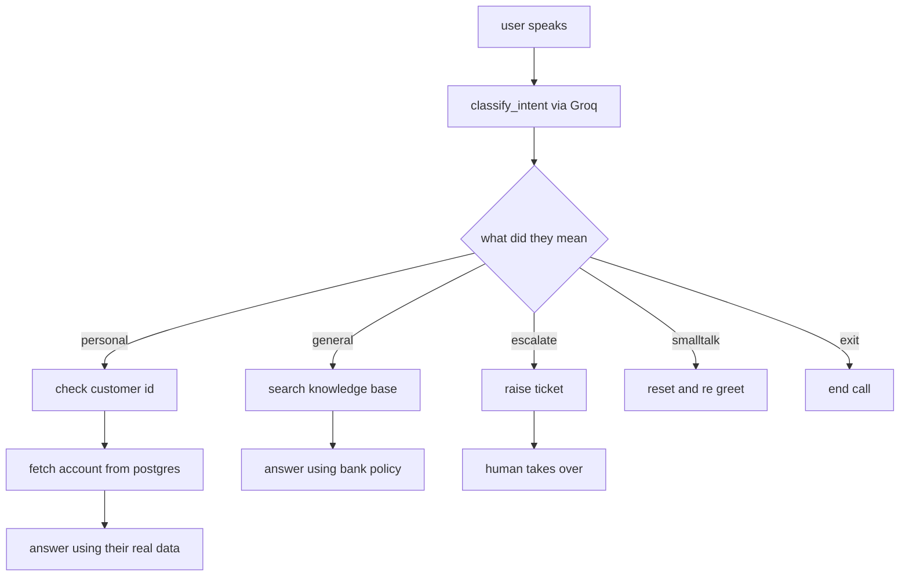

<div align="center">

# Banking Voice Agent

Call it. Talk however you normally talk. It figures out what you want and answers you back, in your language, out loud.

Built by Nihar Nandala

</div>

---

## Try it live

**[add your Render URL here once it's deployed]**

This runs on fake seeded test data, nothing real. Use any of these customer ids to actually try the personal account flow:

`CU001` `CU002` `CU003` `CU004` `CU005` `CU007`

Or just ask something like "what are your interest rates" and skip the id part entirely.

---

## Table of contents

- [What it actually does](#what-it-actually-does)
- [A real call](#a-real-call-unedited)
- [How it routes a request](#how-it-routes-a-request)
- [What I picked and why](#what-i-picked-and-why)
- [Bugs that only showed up once this was live](#bugs-that-only-showed-up-once-this-was-live)
- [What's actually not handled yet](#whats-actually-not-handled-yet)
- [Run it yourself](#run-it-yourself)
- [File layout](#file-layout)

---

## What it actually does

```
"mera balance kya hai"          →  personal    →  db lookup       →  hindi reply
"how to open an account"        →  general     →  rag search      →  policy answer
"address change karna hai"      →  escalate    →  ticket raised   →  human takes over
"i want to know emi policies"   →  general     →  knowledge base  →  spoken answer
```

Four intents. Personal, general, escalate, smalltalk. One model reads what you said, picks a lane, and a different piece of code handles it from there.

---

## A real call, unedited

```
bot:   Hello, welcome to XYZ Bank. Ask me anything about your account.

user:  mera balance kya hai
       intent: personal, confidence: 0.95

bot:   Please tell me your customer id.

user:  my customer id is cu 007
       verified in db, data fetched

bot:   Dhanyawad sir. Aapka balance 1.5 lakh rupees hai.

user:  could you get me some bank emi policies
       intent: general, confidence: 0.80

bot:   EMI har mahine 5 ko automatically deducted hota hai sir.
       Bounce charge 500 rupees per instance hai.

user:  i want to change my bank account
       intent: escalate, confidence: 0.85
       ticket raised: 43A5E499

bot:   I have raised a ticket for you sir. Staff will contact you shortly.
```

---

## How it routes a request


```mermaid
flowchart TD
    A[user speaks] --> B[classify_intent via Groq]
    B --> C{what did they mean}
    C -->|personal| D[check customer id]
    D --> E[fetch account from postgres]
    E --> F[answer using their real data]
    C -->|general| G[search knowledge base]
    G --> H[answer using bank policy]
    C -->|escalate| I[raise ticket]
    I --> J[human takes over]
    C -->|smalltalk| K[reset and re greet]
    C -->|exit| L[end call]
```

---

## What I picked and why

| Piece | Using | Skipped | Why |
|---|---|---|---|
| Speech to text | Vachana by Gnani.ai | Whisper, Azure | Trained on Indian voice data specifically. Handles code switching. |
| LLM | Groq running gpt oss 120b | llama 3.1 8b (started here) | The small model kept mistaking normal Indian English for Hindi. Bigger model reasons better, and llama 3.1 8b is getting retired anyway. |
| Vector search | ChromaDB, local | Pinecone, Weaviate | No API bill, no network to go down, loads once. |
| Id extraction | LLM prompt | Regex | People say ids like "see you zero zero one" out loud. Regex can't parse that. |
| Retrieval cutoff | Dynamic drop detection | Fixed 0.7 threshold | A flat number works on one dataset and fails on another. This looks at the shape of the scores instead. |
| Database | Postgres on Neon, pooled | One shared connection (started here) | One connection meant every balance check waited in line behind the last one. Pool lets them run at the same time. |

**Drop detection in one picture:**

```
scores:   0.91   0.89   0.85   0.61   0.58
gaps:            0.02   0.04   0.24   0.03
                               ^
                        gap of 0.24 beats threshold 0.15
                        cut here, keep the first 3
```

---

## Bugs that only showed up once this was live

<details>
<summary>One shared db connection was quietly making everyone wait</summary>

Every personal question hit the same single `psycopg2` connection. A connection can only run one query at a time, so under real traffic, balance checks queued up one by one even though nothing looked broken.

Fixed with a connection pool. Borrow a connection, use it, give it back.

```python
conn = db_conn.getconn()
try:
    cursor = conn.cursor()
    cursor.execute(query)
finally:
    db_conn.putconn(conn)
```
</details>

<details>
<summary>Circular imports between the router and the handlers</summary>

The intent router needs the handlers. The handlers need a function back from the router. Import both at the top of each file and python gets stuck loading them.

Fixed by importing that one function inside the function body where it's actually used, not at the top of the file.
</details>

<details>
<summary>Failed id check could loop forever</summary>

Wrong customer id sent things back to the classifier, which sent it back to the id handler, which asked again, forever.

Fixed with a retry count that travels with the conversation. Three misses and it escalates to a human instead of asking a fourth time.
</details>

<details>
<summary>LLM JSON kept breaking the parser</summary>

Told to return only json, the model would sometimes wrap it in a code fence or toss in a sentence first. A plain `json.loads()` dies on that.

Fixed with one shared parser that strips the fence, strips the word json if it snuck in, tries to parse, and falls back to something safe if it still fails.
</details>

---

## What's actually not handled yet

Being straight about this instead of letting you find out mid demo.

- Sessions live in memory on whatever instance created them. Fine running as one process. Scale to more than one and a caller can land on an instance that never saw them before.
- The db pool is per instance too. Three instances means three separate pools hitting Neon, not one shared pool of five.
- No otp or email check. Customer id against the database is the only identity gate right now.
- No automated test suite. `eval_full.py` checks accuracy and latency against a labeled set, it's not the same thing as unit tests.
- A local only playback path exists for testing on my own machine (`speak()` in `vachana_tts.py`). Needs a real audio device, never runs on the deployed server.

---

## Run it yourself

```bash
pip install -r requirements.txt
```

`connections/connections.py` needs:

```python
import os
from psycopg2 import pool
from groq import Groq
from dotenv import load_dotenv
load_dotenv()

groq_client = Groq(api_key=os.environ.get("GROQ_API_KEY"))

db_conn = pool.ThreadedConnectionPool(
    1, 5,
    host     = os.environ.get("DB_HOST"),   # use the pooled Neon endpoint
    database = os.environ.get("DB_NAME"),
    user     = os.environ.get("DB_USER"),
    password = os.environ.get("DB_PASSWORD"),
    port     = os.environ.get("DB_PORT"),
    sslmode  = "require"
)
```

Build the knowledge base once:

```bash
python scripts/knowledge_base.py
```

Seed the test customers:

```bash
python scripts/setup_database.py
```

Start it:

```bash
uvicorn app:app --reload
```

Or with Docker:

```bash
docker build -t banking voice agent .
docker run -p 8000:8000 --env file .env banking voice agent
```

---

## File layout

```
app.py                    fastapi entry, sessions, /chat /speak /session /health
llm_intent.py             intent + language classifier, routes to a handler
handlers/
    personal.py             id check, db lookup, account answers
    general.py               knowledge base search, policy answers
    escalate.py               ticket generation, human handoff
    smalltalk.py               resets the conversation
scripts/
    queries.py               db functions
    knowledge_base.py         chromadb search, embeddings, drop detection
utils/
    utils.py                  safe json parsing, speech cleanup
connections/
    connections.py            api keys, pooled db connection, groq client
vachana_stt/
    vachana_tts.py             streaming and full file tts for the browser
```

---

<div align="center">

[GitHub](https://github.com/niharnandala)

</div>